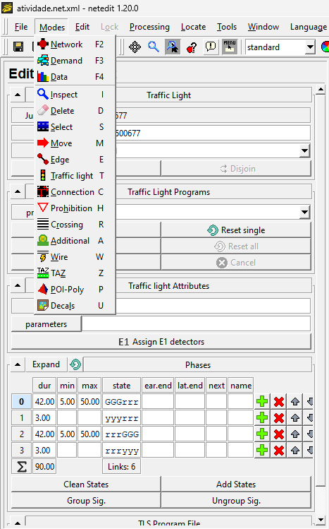
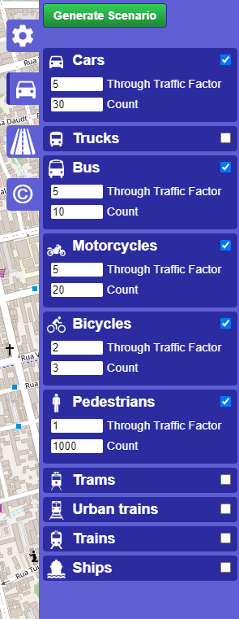
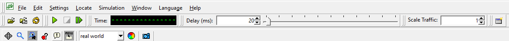

# Guia de Configuração da Simulação no SUMO

## 1. Entendimento dos Arquivos
- **`map.net.xml`**: Define a estrutura da rede de ruas, os tipos de vias, limites de velocidade, número de faixas e restrições de veículos.
- **`atividade.net.xml`**: Contém configurações da simulação, como informações sobre semáforos e características das vias.
- **`config.sumocfg`**: Arquivo de configuração geral da simulação, controlando entrada e saída de arquivos, incluindo rotas e rede.

## 2. Alterar o Tempo dos Semáforos
Para modificar o tempo das sinaleiras (semáforos), siga os passos abaixo:

1. Localize a seção `<tlLogic>` no arquivo `atividade.net.xml`.
2. Altere os valores de `duration` dentro dos `<phase>` para ajustar o tempo de cada fase (verde, amarelo, vermelho).

Exemplo:
```xml
<tlLogic id="node1" type="static" programID="1" offset="0">
    <phase duration="31" state="GrGr"/>
    <phase duration="6" state="yryr"/>
    <phase duration="31" state="rGrG"/>
    <phase duration="6" state="ryry"/>
</tlLogic>
```

ou pelo app 




## 3. Adicionar Carros e Rotas
Para adicionar carros e definir suas rotas, use um arquivo de rotas referenciado em config.sumocfg. Um exemplo de configuração de rota é:

```xml
<routes>
    <vType id="car1" accel="1.0" decel="4.5" length="5" maxSpeed="15"/>
    <vehicle id="vehicle1" type="car1" depart="0" route="route1"/>
    <route id="route1" edges="edge1 edge2 edge3"/>
</routes>
```

ou pelo site




## 4. Execução da Simulação
Após as alterações, execute a simulação no SUMO com o seguinte comando no terminal:

```bash
sumo-gui -c config.sumocfg
```
ou pelo botão de play

